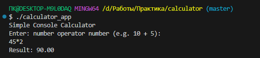

### C++ КОНСОЛЬНИЙ КАЛЬКУЛЯТОР

## Мета проєкту

Цей репозиторій було створено як практичне завдання для демонстрації навичок роботи з системою контролю версій Git та сервісом GitHub. Основна мета — освоєння SSH-зв'язку , структурної організації проєкту та командної розробки через гілки.

## Опис

Простий консольний калькулятор, написаний на C++, який дозволяє користувачу виконувати базові арифметичні операції.

## Мета Репозиторію

Основна мета цього репозиторію — продемонструвати базові та просунуті навички роботи з системою контролю версій Git та платформою GitHub. Це включає встановлення, налаштування SSH-зв'язку, створення комітів, роботу з гілками та оформлення документації.

## Завдання та Функціонал

- calculator.cpp: Містить основний код консольної програми. Його функціонал — приймати на вхід два числа та один оператор (+, -, *, /) і виводити результат обчислення. Також відповідає за перевірку помилки ділення на нуль.
- README.md: Є головним документом проєкту. Його завдання — надати швидкий та повний огляд проєкту, включаючи: мету створення репозиторію, опис функціоналу калькулятора, а також контактну інформацію про автора.
- manual.txt: Файл додаткової технічної документації. Його функціонал — деталізувати інформацію, яка не увійшла до README.md, наприклад: повну структуру проєкту, технічні вимоги для збірки (окрім базових), рекомендації для розробників щодо розширення функціоналу (наприклад, як додати нову математичну операцію) або історію версій.

## Інструкція Запуску

1) Для компіляції необхідно мати встановлений компілятор C++ (g++/MinGW).
2) Виконайте наступні команди в кореневому каталозі репозиторію:
  - Компіляція: $ g++ src/calculator.cpp -o calculator_app
  - Запуск: ./calculator_app

# Приклад Роботи

## Автор

- ПІБ: Рюмшин Кирило Сергійович
- Група: П-31
- Контакти: rumuch.07@gmail.com